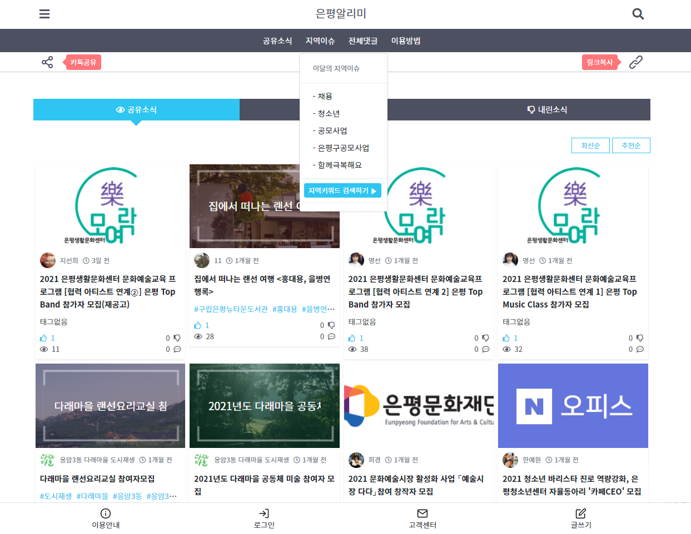

# Chanhyuk, Byeon

> Full-stack web developer, interested in Game dev.

  

## Skills

<!--

LOGO: https://simpleicons.org/?q=google
-->

### In learnings

### Interests

## Orgnaization

- ### [EP Alimi(epalimi)](https://github.com/epalimi)

- ### [OKKorea21(okkorea21)](https://github.com/okkorea21)

## Projects

### 1. [은평알리미](https://www.epalimi.com/)
> [WEB] Local information sharing platform   
> 2019.11~

#### Screenshot

#### Repository
- PRIVATE

#### Used stack

-4FC08D?style=for-the-badge&logo=Vue.js&logoColor=white)

#### 1-1. 은평알리미 - AD
> [ADMINSTRATION/API] Non-profit reward based advertisement system  
> 2022.02~

##### Repository
- PRIVATE

##### Used stack

-4FC08D?style=for-the-badge&logo=Vue.js&logoColor=white)

