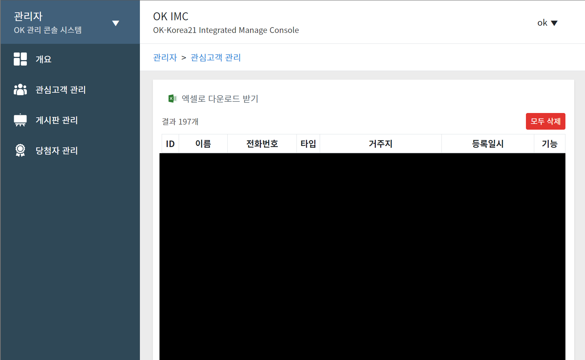

# :dog: 변찬혁(Chanhyuk, Byeon)

> Full-stack web developer, interested in Game dev.

  

    <a href="https://github.com/Bisue">
        <!--  -->
        
    </a>
    

<!--  -->
<!--  -->
<!--  -->

 

## :globe_with_meridians: Sites

### :package: 블로그

- [비수의 개발 창고 (bisue.github.io)](https://bisue.github.io)  
  <!-- - [Repository](https://github.com/Bisue/bisue.github.io) -->

 

## :hammer_and_pick: Skills

<!--

LOGO: https://simpleicons.org/?q=google
-->

### :sunglasses: LIKES

<!--  -->
<!--  -->

### :yum: LEARNINGS

### :kissing_closed_eyes: INTERESTINGS

 

## :department_store: Orgnaizations

- #### [(주)오케이코리아이십일](https://github.com/okkorea21) (외주)
  - 2020.03 ~ : 건설업체 대상 분양사이트 제작 솔루션 개발 및 운영

- #### [은평공리사회적협동조합](https://github.com/epalimi) (외주)
  - 2020.01 ~ : 지역 소식 공유 플랫폼 "은평알리미" 개발 및 운영

 

## :mortar_board: Educations

- **2018.03 ~ 2024.02 :** 동국대학교 컴퓨터공학전공
  - 전체 4.07/4.5
  - 전공 4.34/4.5

## :eyeglasses: Experiences

- **2020.01 ~ :** 지역 소식 공유 플랫폼 "은평알리미" **외주 개발 및 유지보수**
- **2020.03 ~ :** 건설업체 대상 분양사이트 제작 솔루션 **외주 개발 및 유지보수**
- **2021.09 ~ 2021.10 :** 2021년 군 장병 공개SW 해커톤
- **2023.04 ~ 2023.11 :** 2023년 한이음 ICT멘토링 / 공모전 [**입선**](/awards/2023-hanium.pdf)
- **2023.03 ~ 2023.12 :** 2023년 겨울 ICIP&캡스톤디자인 결과발표회 [**우수상**](/awards/2023-icip.pdf)

## :video_game: Projects Overview

#### [> :globe_with_meridians: 블로그에서 보기](https://bisue.github.io/projects)

 

### [지역 소식 공유 플랫폼, 은평알리미](https://bisue.github.io/projects/outsourcing/2-epalimi)  

#### 스크린샷

    

 

---

### [건설업체 대상 분양사이트 솔루션](https://bisue.github.io/projects/outsourcing/1-laravel-wrapper)

#### 스크린샷

    

 

---

### [동국대학교 학사 공지 알리미 "데일리동국"](https://bisue.github.io/projects/personal/daily-dongguk.html)

#### 스크린샷

    
    

 

## Contacts

### :envelope: Email

- bdu00chch@gmail.com

### :earth_asia: Location

- Seoul, South Korea

